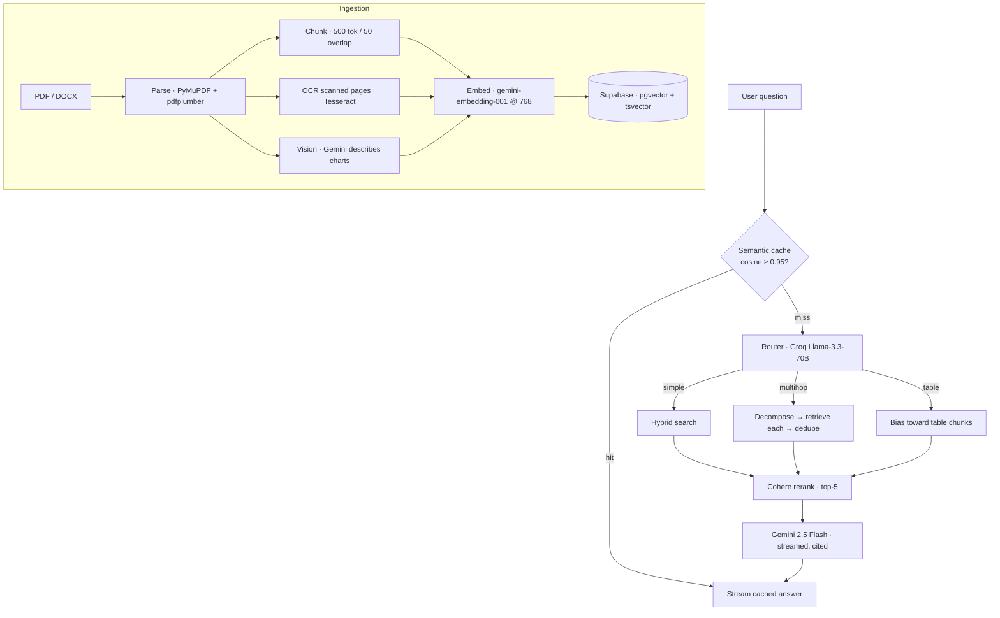

# DocMind

**Agentic document intelligence.** Upload PDFs/DOCX, then chat with them — an agent routes
each question to the right retrieval strategy and streams back an answer with inline citations
to the exact source page.

> "The answer is already written down. It's just buried on page 147 of a document nobody has time to read."

## What it does

- **Cited answers** — every claim links to the page it came from; the model is instructed to say
  "I couldn't find that" rather than invent.
- **Agentic routing** — a Groq-hosted router classifies each question as `simple`, `multihop`, or
  `table` and dispatches accordingly.
- **Hybrid retrieval** — dense (pgvector) + sparse (Postgres full-text) fused with Reciprocal Rank
  Fusion, then reranked by Cohere.
- **Vision + OCR ingestion** — describes charts/infographics and reads scanned pages, so answers
  can come from tables and images, not just text.
- **Product layer** — team workspaces, semantic cache, usage limits, Lemon Squeezy billing.
- **Observability** — RAGAS-style eval scores plus a metrics dashboard (latency, cost, cache-hit
  rate, route distribution).

## Architecture



## Stack

| Layer | Tech |
|---|---|
| Backend | FastAPI (Python 3.11) |
| Frontend | React 18 + Vite + TypeScript + Tailwind |
| DB / Auth / Storage | Supabase (Postgres + pgvector + Auth + Storage) |
| LLMs | Gemini 2.5 Flash (generation + vision), Groq Llama-3.3-70B (routing) |
| Embeddings | `gemini-embedding-001` (768 dims) |
| Reranking | Cohere Rerank v3.5 |
| Billing | Lemon Squeezy |
| Deploy | Railway (backend) · Vercel (frontend) |

## Setup

### 1. Database
Run the SQL in `infra/` in order in the Supabase SQL Editor:
`schema.sql` → `002_tsv_generated.sql` → `003_search_functions.sql` →
`004_cache_and_usage.sql` → `005_metrics.sql`.

### 2. Backend
```bash
cd backend
cp ../.env.example ../.env   # fill in the keys (see below)
uv sync                       # or: python -m venv .venv && pip install -e .
uv run uvicorn app.main:app --reload --port 8000
```
Optional: install [Tesseract](https://github.com/UB-Mannheim/tesseract/wiki) to enable OCR of
scanned pages.

### 3. Frontend
```bash
cd frontend
cp .env.example .env          # VITE_SUPABASE_URL, VITE_SUPABASE_ANON_KEY, VITE_API_URL
npm install && npm run dev
```

### Keys (all have free tiers)
`SUPABASE_URL` · `SUPABASE_SERVICE_KEY` · `SUPABASE_JWT_SECRET` ·
`GEMINI_API_KEY` (aistudio.google.com) · `GROQ_API_KEY` (console.groq.com) ·
`COHERE_API_KEY` (dashboard.cohere.com). Lemon Squeezy keys are only needed for billing.

## Tests & evals
```bash
cd backend
uv run pytest                         # unit tests (chunker, RRF, router, limits, …)
uv run python -m app.evals.run_evals <workspace_id>   # RAGAS-style faithfulness / relevance
```

## Build phases
1. Skeleton · 2. Ingestion · 3. Simple RAG · 4. Agents (router, multi-hop, table-QA, vision, OCR) ·
5. Product (workspaces, cache, billing, limits) · 6. Eval + observability · 7. Polish.
